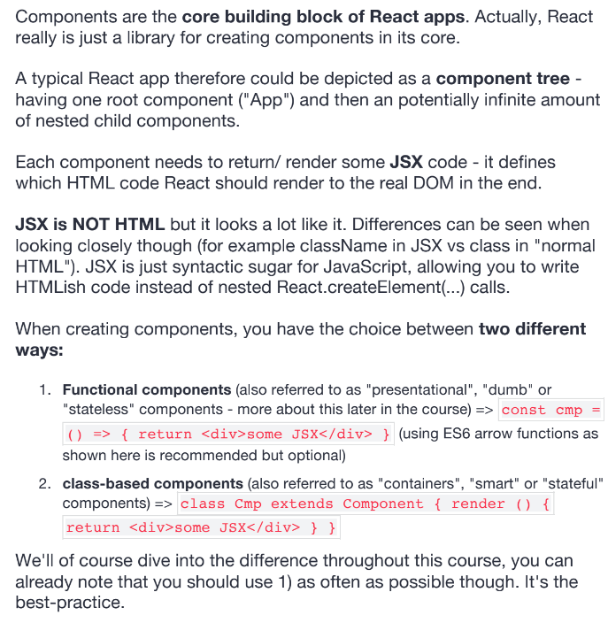

This project was bootstrapped with [Create React App](https://github.com/facebook/create-react-app).

## Available Scripts

In the project directory, you can run:

### `npm start`

Runs the app in the development mode. 
Open [http://localhost:3000](http://localhost:3000) to view it in the browser.

The page will reload if you make edits. 
You will also see any lint errors in the console.

### `npm test`

Launches the test runner in the interactive watch mode. 
See the section about [running tests](https://facebook.github.io/create-react-app/docs/running-tests) for more information.

### `npm run build`

Builds the app for production to the `build` folder. 
It correctly bundles React in production mode and optimizes the build for the best performance.

The build is minified and the filenames include the hashes. 
Your app is ready to be deployed!

See the section about [deployment](https://facebook.github.io/create-react-app/docs/deployment) for more information.

### `npm run eject`

**Note: this is a one-way operation. Once you `eject`, you can’t go back!**

If you aren’t satisfied with the build tool and configuration choices, you can `eject` at any time. This command will remove the single build dependency from your project.

Instead, it will copy all the configuration files and the transitive dependencies (webpack, Babel, ESLint, etc) right into your project so you have full control over them. All of the commands except `eject` will still work, but they will point to the copied scripts so you can tweak them. At this point you’re on your own.

You don’t have to ever use `eject`. The curated feature set is suitable for small and middle deployments, and you shouldn’t feel obligated to use this feature. However we understand that this tool wouldn’t be useful if you couldn’t customize it when you are ready for it.

## Learn More

You can learn more in the [Create React App documentation](https://facebook.github.io/create-react-app/docs/getting-started).

To learn React, check out the [React documentation](https://reactjs.org/).

### Code Splitting

This section has moved here: https://facebook.github.io/create-react-app/docs/code-splitting

### Analyzing the Bundle Size

This section has moved here: https://facebook.github.io/create-react-app/docs/analyzing-the-bundle-size

### Making a Progressive Web App

This section has moved here: https://facebook.github.io/create-react-app/docs/making-a-progressive-web-app

### Advanced Configuration

This section has moved here: https://facebook.github.io/create-react-app/docs/advanced-configuration

### Deployment

This section has moved here: https://facebook.github.io/create-react-app/docs/deployment

### `npm run build` fails to minify

This section has moved here: https://facebook.github.io/create-react-app/docs/troubleshooting#npm-run-build-fails-to-minify

### Define `REACT`

# <<<<<<< HEAD

- 

  > > > > > > > the-basic-features-and-syntax

- React is a Javascript Library for building User Interface
- Run on browser ==> run in the browser, don't have to wait server response to get a new page or render something new
- React using Components for building UI
  <<<<<<< HEAD
  =======
- 

---

> > > > > > > the-basic-features-and-syntax

### Implement `REACT`

Component in React like a function and we use to reuse code

- Component can have paramerter like a object when we reference to
- When want to reuse or duplicate "Html" code. Should create a id, which can reference the "HTML" code parameters
- "render" function: 2 parameters:
  _ function
  _ position which we want to use

# <<<<<<< HEAD

> > > > > > > the-basic-features-and-syntax

### ES06

2.let & const

- let: variable value
- const: constant value
  3.Arrow functions:
- Syntax: `const <name_func> = () => {}`
- No more issuses with the "this" keywork
- When use "this" inside an arrow function it will always keep its context and dont change surprisingly on runtime

  4.Export and Import:

- Two ways to import:

  - default exports: we can call it by the another name - import person from .... - import prs from ....

      * named exports: we cann't call it by the another name, must call defined name
      	- import {base} from ...
      	- import {base as Base} from ...

      * If have many constant want to import from 1 file: use *
      	- import * as bundled from ...  ==> when we access variable we can use: bundled.name, bundled.base or ....

- 

---

5.Classes:

---

6.Classes, Properties & Methods

- 

---

7.Spread & Rest operator:

- Speard: copy old array/object to new array/object with the same content
- Rest: converse elements to array and implement array's methods
  

---

8.Destructuring:

- Creating the variables referencing elements and propertities in array and object respectively

  >     const numbers = [1,2,3];
  >     [num1,num2] = numbers;
  >
  >     // [num1,,num3] = numbers;
  >     console.log(num1,num2);
  >     // console.log(num1,num3);

- 

---

### Install `REACT PROJECT`

- install package:
  >      1.npm install create-react-app -g
  >      2.create-react-app <name_project>
  >      3.cd <name_project>
  >      4.npm start

### Structure in `REACT` folder

- _package.json file_: inclusde dependencies created by `creact-react-app` and scripts implement program
- _node_modules folder_: holds the dependencies and sub-dependencies of our project
- _public folder_: holds the files we can edit, the script files are added in the source folder

  - _index.html file_:

    - > Important and only has one, we will never add more html pages in this project.

    - > This is single page, where in the end our script files will get injected by that build workflow ==> don't see a script import here and you can edit this file but we won't write any html.

### Component

- This app component actually gets used in the index.js file where you render it into the place of this root
- 

- 

---

### The basic features and syntax

- #### JSX
  - JSX is just syntactic sugar for JavaScript, allowing you to write HTMLish code instead of nested React.createElement(...) calls.
  - Use `React.createElement(<another_component, null, children_of_another_component>)` it has at leat three arguments ==> This is some things will compiled for `html code`
- #### Functional Component

  - Like component => This is another way we can create the component in `React`

- #### Working with component and re-using them

  - We can focus our code in each file and hence make it much more maintainable

- #### Props Children

  - The place lies between opening and closing tag
  - 

- #### Handling events with methods

  - Just add reference for function, don't add parenthese

- #### Manipulating the `State`

  - `setState` method in `Component` which allows us to update this special `state property` here and it will then ensure that React gets to know about this update and updates the DOM
  - 

  ***

- #### Using the useState() Hook for State Manipulation

  - > What is a Hook? A Hook is a special function that lets you “hook into” React features. For example, useState is a Hook that lets you add React state to function components. We’ll learn other Hooks later.

    > When would I use a Hook? If you write a function component and realize you need to add some state to it, previously you had to convert it to a class. Now you can use a Hook inside the existing function component. We’re going to do that right now!

  - Change `component` to `functional component`
  - useState() nethod:
    - always returns an array with exactly 2 elements
    - reference a constant: [state, setState: this is a method]
      - state: gives access to this object
      - setState: method to update state
  - :key: **When use `useState` must change `lowerCase` to `capital`**

  - :key: **Using `Hook` doesn't merge whatever you pass to it with the old state ==> instead it replaces the old state with it**

  - 

  ***

- #### Stateless and Stateful components

  - `Stateful component = smart or container component`: is a component that manages state, no matter if it's using the `useState` hook or a class-based approach with the state property
  - `Stateless component`: has no internal state manangement and call `dumb`

- #### Passing method references between components

  - Can pass methods also as props so that you can call a method which might change the state in another component

    - > Ex: App.js and Peson.js

      > In App.js: add another property (click={this.switchNameHandler.bind(this, "Max!")})

      > In Person.js: call `onClick` method (onClick={this.switchNameHandler.bind(this, "Max!")})

- #### Adding two way binding
  - Using `onChange` method. It will be fired whenever the value in this input changes

### Working with List and Conditionals

- #### Handling dynamic content the javascript way

  - 

- #### Outputting lists
  - 

### Styling React components & elements

- #### Adding and Using Radium

  - Want to use pseudo for css in `.js` file must install thirty package: **`Radium`**
  - The way:
    - > `npm install --save radium`

- #### Enabling & Using CSS modules

  - The way:
    - > `npm run eject` ==> y

- ### Diving deeper into components react internals
  - #### A better project structure
    - > Seperating packages:
      >
      > - components: includes components of project
      > - assets: includes images and some files
      > - containers: includes `app.js` file and its respective files
  - #### Comparing Stateless and Stateful components
    - > - Stateless component don't manage state: function component
    - > - Stateful component manage state: class component or class-base component
